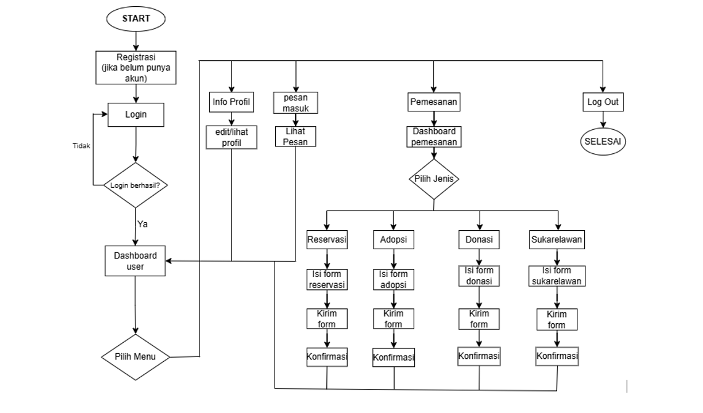
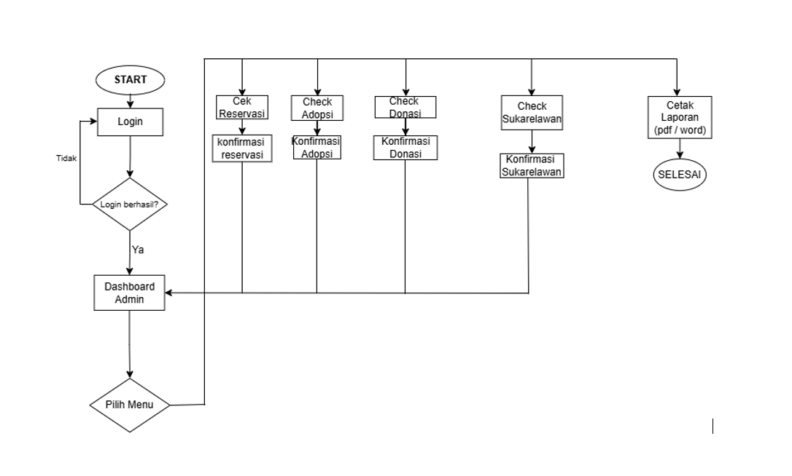

# Nama Aplikasi
PetCare – Sistem Manajemen Penitipan Hewan Peliharaan Berbasis Web

Aplikasi web untuk sistem penitipan hewan berbasis Flask dengan MySQL.

# Kegunaan Aplikasi
Aplikasi Sistem Penitipan Hewan (PetCare) dirancang untuk membantu pemilik hewan dan pengelola penitipan hewan dalam mengelola layanan penitipan secara lebih efektif dan terorganisir. Aplikasi ini mampu menyajikan informasi terkait reservasi, adopsi, donasi, dan sukarelawan, sehingga memudahkan pengguna dalam memantau status layanan yang sedang berlangsung.

Selain itu, aplikasi ini memungkinkan admin untuk mengelola data secara terpusat dan menghasilkan laporan, sehingga proses administrasi menjadi lebih cepat dan akurat. Dengan menggunakan aplikasi ini, pemilik hewan tidak perlu melakukan pencatatan manual atau datang langsung untuk proses administrasi, sementara pengelola dapat meningkatkan kualitas pelayanan, mengurangi kesalahan pencatatan, serta mengoptimalkan manajemen operasional penitipan hewan secara lebih efisien.

# Tujuan dari pembuatan aplikasi ini adalah:
- Menerapkan framework Flask dalam pengembangan aplikasi web
- Mengimplementasikan autentikasi user dan admin
- Mengelola data penitipan hewan secara terstruktur menggunakan database MySQL

# Flowchart
Berikut adalah flowchart yang menggambarkan alur kerja aplikasi:

## Flowchart User


## Flowchart Admin


# Perkenalan Tim
- Suci Muqsithin (2313010539) - Leader + Programmer
- Ardi Joko Susilo (2313010540) - Programmer
- Shafa Nabila Ivana Putri (2313010520) - Programmer
- Fauzi Diana Pertiwi (2313010532) - Presenter

# Tautan Video Dokumentasi
Anda dapat menonton video dokumentasi aplikasi melalui tautan berikut:
https://youtu.be/lukFFZRDhlw?si=5Xgg37O45TkbtrRR


## Persyaratan Sistem

- Python 3.8 atau lebih baru
- MySQL Server
- Git (opsional)

## Instalasi

1. **Clone atau download project ini**

2. **Install dependencies Python:**
   ```bash
   pip install -r requirements.txt
   ```

3. **Setup Database MySQL:**
   - Pastikan MySQL Server sudah terinstall dan berjalan
   - Buat database baru (opsional, aplikasi akan membuat otomatis jika belum ada):
     ```sql
     CREATE DATABASE petcare;
     ```
   - Konfigurasi koneksi database ada di `app.py` (default: localhost, user: root, password: kosong)

4. **Jalankan aplikasi:**
   ```bash
   python app.py
   ```

5. **Akses aplikasi:**
   - Buka browser dan kunjungi: `http://localhost:5000`

## Fitur Utama

- **Admin Dashboard:** Kelola reservasi, adopsi, donasi, dan sukarelawan
- **User Dashboard:** Buat reservasi, adopsi, donasi, dan pendaftaran sukarelawan
- **Laporan:** Export data ke Excel dan PDF
- **Sistem Pesan:** Komunikasi antara admin dan user

## Akun Default

**Admin:**
- Email: admin@example.com
- Password: admin123

**User:**
- Email: user1@example.com
- Password: user123

## Struktur Project

```
flask_penitipan_hewan/
├── app.py                 # Main application file
├── requirements.txt       # Python dependencies
├── static/               # Static files (CSS, JS, images)
│   ├── css/
│   ├── images/
│   └── uploads/
├── templates/            # HTML templates
│   ├── admin/           # Admin templates
│   └── user/            # User templates
└── README.md            # This file
```

## Teknologi yang Digunakan

- **Backend:** Flask (Python)
- **Database:** MySQL
- **Frontend:** HTML, CSS, Bootstrap
- **Libraries:** pandas, reportlab, openpyxl

## Troubleshooting

1. **Error koneksi database:**
   - Pastikan MySQL Server berjalan
   - Periksa konfigurasi di `app.py`
   - Pastikan user MySQL memiliki akses ke database

2. **Port 5000 sudah digunakan:**
   - Ubah port di `app.py` atau stop aplikasi lain yang menggunakan port tersebut

3. **Import error:**
   - Pastikan semua dependencies terinstall dengan `pip install -r requirements.txt`

## Lisensi

Project ini dibuat untuk keperluan edukasi.
